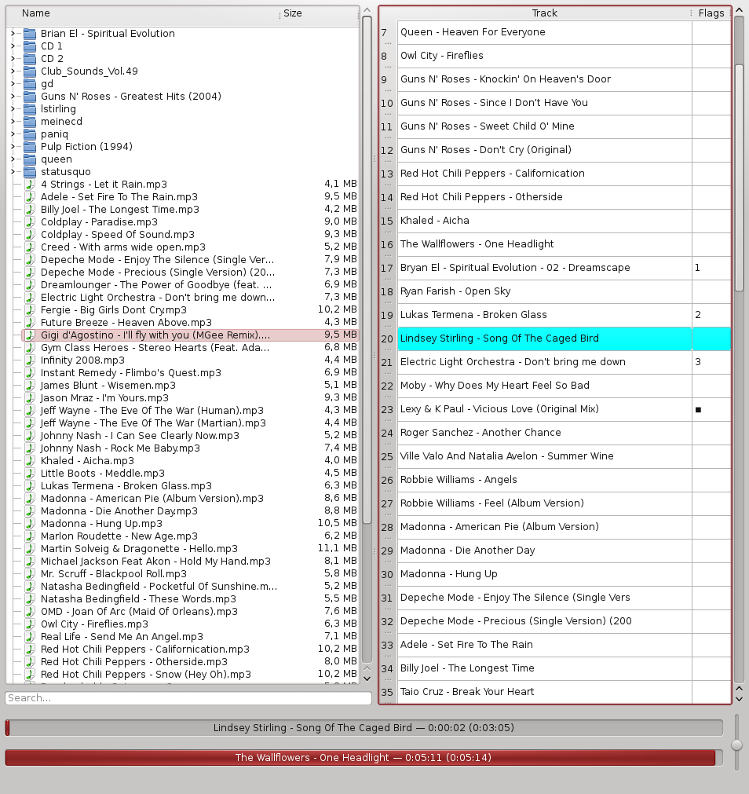

FailPlay
========

FailPlay is a media player with an extremely simplistic user interface combined with a set of unique features:

* Queue: Titles in the playlist can be enqueued to change the order in which tracks are played without changing the
  playlist.
* AutoStop: One track can be selected after which playing will stop. This can be any track you want, be it right in the
  middle of the playlist, after the last track of a queue, or in the middle of a queue. As soon as the selected title has
  been played, the player stops (read: exits).
* Repeat can be configured for one specific title, and will start as soon as that title is reached. When repeat is disabled
  for that title (or set for a different one), the playlist/queue will continue.
* If no track is configured to be the last one, playback will not end. Instead the whole playlist will repeat.
* The playlist and queue are saved between restarts, if you so choose. Format is a simple PLS file that should be compatible
  with other players (only tested with mplayer).
* Double-Clicking on a file adds it to the playlist, double-clicking in the playlist adds/removes the title from the queue.
* Crossfading between songs.
* Drag-and-Drop playlist reordering. (Yeah I know every player does this. FailPlay does too.)
* Aggressively simple user interface: One window, files on the left, playlist on the right, progress at the bottom, and
  a little playlist context menu to enable AutoStop/Repeat. That's it.

FailPlay doesn't (and probably never will) have:

* Play/Stop/Skip/Previous buttons. As long as it runs, it plays. Without interruption.
* Volume change thingy. Use your remote. Or `pavucontrol`.
* Support for streams, as you don't gain anything from the cool playlist features for streams.

Screenshots
-----------

FailAudio
=========

FailPlay also comes with a command-line player named `failaudio`, which has the same features (crossfade, queue) but is intended
for more ad-hoc use.

Note that unlike FailPlay, `failaudio` does *not* infinitely repeat its playlist, but plays it only once.

Requirements
============

* python-pyao
* python-qt4
* libavcodec-dev, libavformat-dev, python-dev (for building myffmpeg)

Config
======

FailPlay doesn't really need much configuration, but setting a bit of stuff in `~~/.failplay/failplay.conf` does make life more convenient. Here's my config file:

    [options]
    musicdir = /media/daten/Musik
    playlist = /home/svedrin/.failplay/failplay.pls
    writepls = /home/svedrin/.failplay/failplay.pls
    enqueue  = True
    out = pulse

    [environment]
    PULSE_SERVER = tcp:gatekeeper

Variables in the `[environment]` section will be exported before initializing audio output, so it can be used e.g. to
connect to a remote PulseAudio server. The `options` section accepts the same variables that can also be given on the
command line as long options.

FailAudio supports a config file as well, and evaluates `~/.failplay/failaudio.conf` in the same manner.

Both FailPlay and `failblaster` can also expose a web interface by adding `web` (and optionally
`uploaddir`) to the `[options]` section:

    [options]
    web       = 8080
    uploaddir = /media/daten/Musik/uploads

`web` is the port to listen on; the web server stays disabled unless it's set. `uploaddir` enables
uploading files through the web interface and is optional. Both can also be given on the command
line as `--web` and `--uploaddir`.

Both `failaudio` and `failblaster` load `~/.failplay/failplay.conf` and then load `~/.failplay/fail{audio,blaster}.conf`
respectively, so that you can override certain settings while reusing most of them.

Bluetooth speaker scripts
=========================

`bt_failaudio.sh`, `bt_failblaster.sh` and `bt_failplay.sh` watch for a bluetooth speaker to
connect, route PulseAudio to it, and run `failaudio`/`failblaster`/`failplay` for as long as
it stays connected. All three read their settings from `~/.failplay/bluetooth.conf`, a plain
shell snippet that's sourced by the scripts. Minimal config:

    BT_MAC="AA:BB:CC:DD:EE:FF"

`BT_MAC` is required; find your device's address with `bluetoothctl devices`. `POLL_INTERVAL`
(seconds between connection checks, default `10`) can also be set there, or overridden via the
`POLL_INTERVAL` environment variable if the config file doesn't set it.
